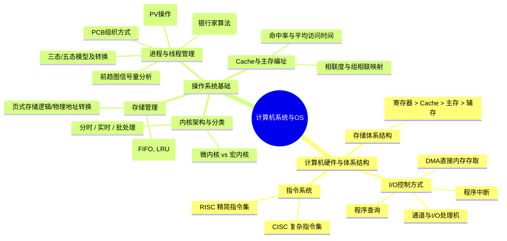

# 直播第1次：计算机系统基础知识（一）与备考导学

- **源课件**：`202611架构师直播第1次-计算机系统基础知识1.pdf`
- **页数**：73 页
- **主讲**：姜美荣

---

## 一、备考导学与考试考情

### 1. 考试科目与时间安排

| 科目 | 题型与题量 | 考试时间 | 建议答题时间 | 满分 / 及格分 |
| :--- | :--- | :--- | :--- | :--- |
| **综合知识** | 75 道单选题 | 8:30 ~ 12:30（机考连考） | 150 分钟 | 75 分 / 45 分 |
| **案例分析** | 1 题必答 + 4 选 2 | 机考连考（共 240 分钟） | 90 分钟 | 75 分 / 45 分 |
| **论文写作** | 4 选 1（大作文，约 2500 字） | 14:30 ~ 16:30 | 120 分钟 | 75 分 / 45 分 |

> [!NOTE]
> **备考核心策略**：
> - **综合知识**：以精讲与章节练习为基础，刷题巩固细节，覆盖考点死角。
> - **案例分析**：以真题与直播为纲，掌握架构设计答题套路与标准踩分关键词。
> - **论文写作**：在理解基础上提炼个人项目素材，搭建可复用的架构论文体系。
> - **原则**：“一次通过考试就是最低成本”，录播为主、直播为纲、刷题为王、充足练习。

---

## 二、知识结构 / 知识图谱

---

## 三、核心考点与原理详解

### 1. 计算机存储体系层次结构

- **层次与性能对比**：
  $$\text{寄存器（Register）} > \text{高速缓存（Cache）} > \text{主存（内存）} > \text{外存（辅存/磁盘）}$$
- **规律**：越靠近 CPU 的存储部件，**速度越快、容量越小、每位成本越高**。
- **只读存储器（ROM）分类**：
  - `PROM`：可编程只读存储器（一次性写入）。
  - `EPROM`：可擦除可编程只读存储器（紫外线擦除）。
  - `EEPROM`：电可擦除可编程只读存储器。
  - `Flash Memory`：闪存（电可擦写，断电不丢失，属于 EEPROM 衍生）。

---

### 2. I/O 数据传输控制方式对比

| 方式 | 控制机制 | CPU 介入程度 | 数据传输通路 | 适用场景 |
| :--- | :--- | :--- | :--- | :--- |
| **程序查询（控制）** | CPU 轮询查询外设状态字 | **全程等待/轮询**，CPU 效率最低 | 外设 $\leftrightarrow$ CPU $\leftrightarrow$ 内存 | 简单系统、低速设备 |
| **程序中断** | 外设准备就绪向 CPU 发中断请求 | CPU 在传输开始响应中断，**无需等待** | 外设 $\leftrightarrow$ CPU $\leftrightarrow$ 内存 | 中低速设备、随机事件 |
| **DMA 方式** | 专用 DMA 控制器硬件接管总线 | **仅在传输开始与结束时介入** | 外设 $\leftrightarrow$ 主存（直接成批传输） | 高速、大批量数据传输 |
| **通道方式** | 专用通道处理机执行通道程序 | CPU 只发出启动指令，**完全独立** | 外设 $\leftrightarrow$ 主存 | 大型主机系统 |

> [!IMPORTANT]
> **中断处理过程与软硬件分工（高频必考）**：
> 1. **硬件自动完成**：根据中断号查找**中断向量表**，获取中断服务程序入口地址，并将 PC / PSW 压栈。
> 2. **操作系统（中断服务程序）完成**：保护现场（保存通用寄存器状态、保存中间计算结果、记录中断偏移量）、执行中断服务、恢复现场、中断返回。

---

### 3. CISC 与 RISC 指令系统对比

| 对比维度 | CISC（复杂指令集） | RISC（精简指令集） |
| :--- | :--- | :--- |
| **指令数量与格式** | 指令数量多（数百条），变长格式 | 指令数量少（几十~上百条），**定长格式** |
| **指令执行周期** | 大部分指令需多周期执行 | **绝大多数单周期执行** |
| **访存指令限制** | 大多数指令均可直接访问内存 | **仅 Load / Store 指令可访问内存** |
| **通用寄存器** | 数量较少 | **数量多**，充分利用寄存器减少访存 |
| **控制器实现** | 大量采用**微程序控制技术** | **硬布线逻辑（组合逻辑）为主** |
| **流水线支持** | 流水线实现复杂，效率一般 | **天生适合高效流水线** |
| **编译优化** | 编译简单，指令功能复杂 | **高度依赖优化编译器** |

---

### 4. 操作系统分类与核心特征

1. **多道批处理系统**：
   - **特点**：多道程序同时入内存，宏观上并行、微观上串行，**显著提高 CPU 和外设利用率**。
2. **分时操作系统**：
   - **特点**：采用**时间片轮转**为多用户服务。具备**多路性、独立性、交互性、及时性**。
   - **考点**：时间片固定时，**用户数（进程数）增多**会导致系统轮转周期延长。
3. **实时操作系统**：
   - **特点**：强实时性、高可靠性，强调在严格的截止时间内做出响应。
4. **微内核操作系统**：
   - 将文件管理、设备驱动、网络协议等移至**用户态（服务进程）**，内核仅保留最基本的 **IPC（进程间通信）、底层中断处理、线程调度**。
   - **优点**：高可靠性、高可扩展性、安全性高；**缺点**：用户态与内核态频繁切换导致性能开销较大。

---

### 5. 进程管理、状态转换与 PCB

- **进程定义**：程序在某个数据集合上的运行过程，是系统进行**资源分配和调度的基本单位**（具备**动态性、并发性、独立性、异步性**，动态性是最基本特征）。
- **线程定义**：作为 **CPU 独立调度和分派的基本单位**，共享所属进程的资源。
- **三态/五态转换**：
  - **执行态 $\to$ 就绪态**：时间片用完，或被更高优先级进程抢占。
  - **执行态 $\to$ 阻塞态**：等待某事件发生（如发起 I/O 请求、申请互斥资源失败）。
  - **阻塞态 $\to$ 就绪态**：所等待事件完成（如 I/O 操作结束、获得释放的资源）。
  - *(注意：阻塞态不能直接转为执行态)*
- **PCB 组织方式**：
  - **线性表**：查找需要扫描全表。
  - **链接方式**：相同状态的 PCB 链接成独立队列（就绪队列、阻塞队列）。
  - **索引方式**：按状态建立索引表。

---

### 6. 进程同步、互斥与 PV 操作

- **信号量 $S$ 的物理意义**：
  - $S \ge 0$：表示系统中当前可用资源的数量。
  - $S < 0$：表示系统中无可用资源，**$|S|$ 表示阻塞队列中等待该资源的进程个数**。
- **PV 操作原理**：
  - **$P(S)$ 操作（申请资源）**：$S \leftarrow S - 1$；若 $S < 0$，则进程进入阻塞队列。
  - **$V(S)$ 操作（释放资源）**：$S \leftarrow S + 1$；若 $S \le 0$，则唤醒阻塞队列中的一个进程。
- **互斥模型**：互斥信号量初始值通常设为 $1$；进入临界区前执行 $P$，退出临界区后执行 $V$。
- **前趋图（DAG）与信号量分析口诀**：
  - 每一个有向边对应一个同步信号量，初值通常为 $0$。
  - **起点进程运行完毕 $\to$ 对出边执行 $V$ 操作（发出通知）**。
  - **终点进程开始运行前 $\to$ 对入边执行 $P$ 操作（等待就绪）**。

---

### 7. 死锁产生条件与银行家算法

- **死锁四个必要条件**：
  1. **互斥条件**：资源独占。
  2. **请求与保持条件**：进程持有资源并请求新资源。
  3. **不剥夺条件**：资源不能被强行抢占。
  4. **循环等待条件**：存在进程-资源的环形等待链。
- **死锁处理策略**：
  - **预防死锁**：静态破坏四大必要条件之一（如资源按序分配破坏循环等待）。
  - **避免死锁**：在资源分配过程中进行动态评估，确保系统处于**安全状态**（核心算法：**银行家算法**）。
  - **死锁检测与解除**：通过资源分配图化简进行死锁检测，通过剥夺资源或终止进程解除死锁。
- **系统不发生死锁的最小资源数公式**：
  $$M \ge \sum (W_i - 1) + 1$$
  *(其中 $M$ 为系统资源总数，$W_i$ 为各进程所需最大资源数)*

---

### 8. 页式存储管理与地址计算

- **结构划分**：
  - 逻辑地址 = 页号 $P$ + 页内偏移量 $W$。
  - 物理地址 = 块号（页框号） $B$ + 页内偏移量 $W$。
- **计算核心步骤**：
  1. 根据**页面大小**求得页内地址位数 $k$（如页面大小为 $4\text{ KB} = 2^{12}\text{ B}$，则低 12 位为页内偏移，十六进制占 3 位）。
  2. 截取逻辑地址的高位作为**页号**。
  3. 查页表获取对应的**物理块号**。
  4. 物理地址 = 物理块号 + 原页内偏移。
- **淘汰算法**：
  - `FIFO`（先进先出）：可能出现 Belady 异常。
  - `LRU`（最近最少使用）：依据访问历史时间，性能接近最优。

---

### 9. Cache 与主存映射计算

- **平均访问时间公式**：
  $$t_a = h \cdot t_c + (1 - h) \cdot t_m$$
  *(其中 $h$ 为命中率，$t_c$ 为 Cache 读写周期，$t_m$ 为主存读写周期)*
- **Cache 映射方式**：
  - **直接映射**：主存块只能放入 Cache 指定行（$i = j \bmod C$），冲突率高。
  - **全相联映射**：主存块可放入 Cache 任意行，冲突率最低，查找硬件成本最高。
  - **组相联映射**：将 Cache 分为若干组，每组包含 $N$ 个块（$N$-way 组相联）。主存块映射到固定组，但在组内任意放置。

---

## 四、精选真题与案例演练

### 【真题 1】中断处理中的软硬件分工（2026.05 架构）
**题干**：在中断处理过程中，以下哪项工作不是由操作系统完成的？
- A. 保存通用寄存器状态
- B. 根据中断号查找中断向量表中的服务程序入口地址
- C. 记录被中断程序的中断偏移量
- D. 保存内存中计算的中间结果

**解析**：
- **答案：B**。
- 选项 B 是 CPU 内部硬件逻辑在中断响应周期内自动执行的硬件动作；A、C、D 属于保存现场和恢复现场范畴，由操作系统的中断服务程序代码完成。

---

### 【真题 2】页式存储物理地址转换（经典高频）
**题干**：某计算机系统页面大小为 $4\text{ KB}$，若进程页面变换表如下所示（0号页 $\to$ 2号块，1号页 $\to$ 3号块，2号页 $\to$ 1号块），逻辑地址为十六进制 `1D16H`。该地址转换后的物理地址是？

**解析**：
- 页面大小 $4\text{ KB} = 2^{12}\text{ B}$，即低 12 位（十六进制低 3 位 `D16H`）为页内地址。
- 逻辑地址 `1D16H` 的最高位 `1` 为页号（即 1 号页）。
- 查表可知：1 号页对应的物理块号为 3 号块。
- 拼接物理地址：高位块号 `3` + 低位页内地址 `D16H` = `3D16H`。

---

## 五、备考与冲刺提示

1. **中断响应流程**：严格区分“硬件中断向量寻址”与“软件中断现场保护”。
2. **CISC 与 RISC**：牢记 RISC 的“硬布线、单周期、通用寄存器多、仅 Load/Store 访存”。
3. **PV 操作题**：画出前趋图，牢记“**入度对应 P，出度对应 V**”，信号量逐个编号不重不漏。
4. **页式存储**：先换算页面大小为 $2^k$，分清十六进制与二进制位数对应关系再拆分高低位。
