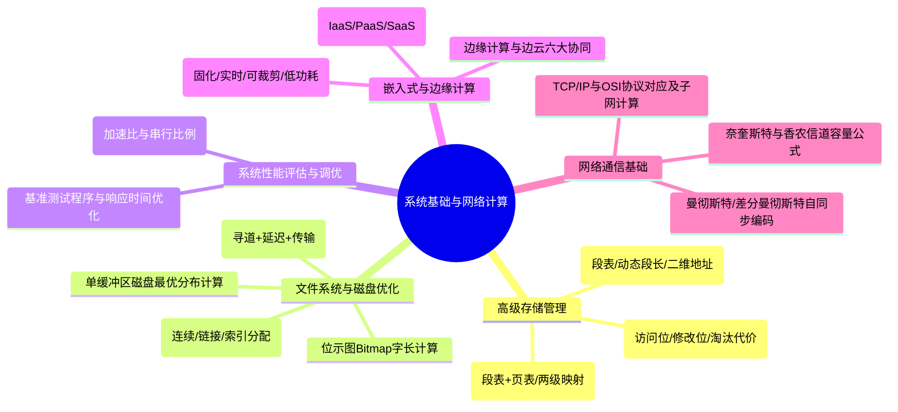

# 直播第2次：计算机系统基础知识（二）与系统架构综合

- **源课件**：`202611架构师直播第2次-计算机系统基础知识2.pdf`
- **页数**：83 页
- **主讲**：姜美荣

---

## 一、本课概要

本次直播在计算机硬件与操作系统基础上进一步深入，重点覆盖**存储高级管理（段式、段页式、请求分页淘汰策略）**、**文件系统与磁盘 I/O 调度优化**、**系统性能评估（Amdahl 定律）**、**嵌入式系统特性**、**计算机网络通信与子网计算**以及**云计算与边云协同架构**，同时穿插大量最新真题综合计算与高频考点。

---

## 二、知识结构 / 知识图谱

---

## 三、核心考点与原理详解

### 1. 存储管理方式深度对比

| 存储管理方式 | 划分机制 | 逻辑地址结构 | 优点 | 缺点 |
| :--- | :--- | :--- | :--- | :--- |
| **页式存储** | 物理与逻辑等分（固定页大小） | 页号 + 页内偏移（一维） | 内存利用率高、碎片小 | 增加了系统查表开销、可能产生抖动 |
| **段式存储** | 按程序逻辑分段（**段长可动态变化**） | 段号 + 段内地址（二维） | **便于程序共享与保护、段长动态增长** | 易产生外部碎片、内存利用率较低 |
| **段页式存储** | **先分段、段内再分页** | 段号 + 段内页号 + 页内偏移 | 兼具段式共享保护与页式无外碎片优点 | 需查段表和页表（多次访存），硬件与软件开销大 |

> [!IMPORTANT]
> **段页式映射关系**：
> - **每个进程一张段表，每个段对应一张页表**。
> - 访问一个内存数据需访问 3 次内存：查段表 $\to$ 查页表 $\to$ 访问目标物理单元（引入 TLB 快表后可降低为 1 次）。

---

### 2. 页面淘汰算法与状态位辨析

在请求分页系统中，页面淘汰优先准则：
1. **优先淘汰未被访问过的页面**（访问位为 `0`，依据时间局部性原理）。
2. **若均被访问过，优先淘汰未被修改过的页面**（修改位为 `0`）。
   - **原因**：未修改的页面与外存磁盘内容一致，无需写回磁盘，换出开销最小。

---

### 3. 文件物理分配结构

- **连续分配**：占用连续磁盘块，支持快速随机访问；缺点是容易产生碎片，文件无法动态扩展。
- **链接分配**：通过指针链表链接离散块，便于动态扩充；缺点是**仅支持顺序访问，不支持随机访问**。
- **索引分配**：为每个文件分配索引块（Index Block），记录所有数据块地址。**既支持文件长度动态变化，又原生支持随机访问**。

---

### 4. 位示图（Bitmap）存储空间计算

- **基本原理**：每个物理块（扇区/页框）在位示图中占用 **1 个二进制位（bit）**，`0` 表示空闲，`1` 表示已占用。
- **计算公式**：
  $$\text{总块数} = \frac{\text{磁盘/内存总容量}}{\text{块大小/页大小}}$$
  $$\text{位示图所需字数} = \left\lceil \frac{\text{总块数}}{\text{系统字长（bit）}} \right\rceil$$
- **经典真题示例**：
  - 内存 16 GB，页面大小 4 KB，系统计算位示图大小：
    $$\text{总页数} = \frac{16\text{ GB}}{4\text{ KB}} = 4 \times 1024 \times 1024 = 4{,}194{,}304\text{ 页}$$
    $$\text{总字节数} = \frac{4{,}194{,}304\text{ bit}}{8} = 524{,}288\text{ B} = 512\text{ KB}$$

---

### 5. 磁盘单缓冲区与数据优化分布计算

- **磁盘读取时间构成**：
  $$T_{\text{read}} = T_{\text{seek}}(\text{寻道}) + T_{\text{latency}}(\text{旋转延迟}) + T_{\text{transfer}}(\text{传输时间})$$
- **顺序存放与最长时间**：
  - 磁头读取记录后，CPU 需处理时间；当 CPU 处理完毕时，磁头已旋转滑过后续物理块，必须等待磁盘旋转一周回到该记录位置。
  - **最长时间** = 读第1块 + 处理第1块 + $(N - 1) \times (\text{旋转一周} + \text{读取} + \text{处理})$。
- **优化分布（Interleaving）与最短时间**：
  - 将逻辑连续的记录间隔放置在磁盘上，使 CPU 处理完前一块记录时，磁头恰好旋转到下一块逻辑记录的起始点。
  - **最短时间** = $N \times (\text{读取时间} + \text{处理时间})$。

---

### 6. 阿姆达尔（Amdahl）定律

- **公式**：
  $$\text{加速比 } S = \frac{1}{(1 - F) + \frac{F}{k}}$$
  *(其中 $F$ 为可并行/可增强部分的比例，$1 - F$ 为不可优化的串行部分比例，$k$ 为增强部件的加速倍数)*
- **核心结论**：系统的最大加速比受限于**不可优化的串行部分**。当 $k \to \infty$ 时，最大极限加速比为 $\frac{1}{1 - F}$。

---

### 7. 嵌入式系统与软件

- **嵌入式软件核心特性**：
  - **资源受限**：内存、计算能力和功耗有限。
  - **高实时性**：强实时（硬实时）与弱实时（软实时）。
  - **高可靠性与专用性**：专为特定硬件与应用场景定制。
  - **软件固化与可裁剪性**：使用动态库与重定位支持模块裁剪。

---

### 8. 计算机网络与通信计算

- **奈奎斯特准则（无噪信道）**：
  $$C_{\max} = 2B \log_2 M \quad (\text{bps})$$
- **香农定理（有噪信道）**：
  $$C = B \log_2 (1 + S/N) \quad (\text{bps})$$
  *(注意：$\text{SNR(dB)} = 10 \log_{10} (S/N)$)*
- **自同步编码**：
  - **曼彻斯特编码**与**差分曼彻斯特编码**：每个位周期中心均有电平跳变，跳变既表示数据，又自带时钟同步信号。
- **子网掩码与主机数**：
  - 掩码 `/29`（`255.255.255.248`），主机位 $32 - 29 = 3$ 位，可用主机地址数 $= 2^3 - 2 = 6$。

---

### 9. 云计算与边云协同

- **云计算服务层级**：
  - **IaaS（基础设施即服务）**：虚拟机、存储、网络（如 AWS EC2、阿里云 ECS）。
  - **PaaS（平台即服务）**：运行环境、数据库、中间件（如 Docker、K8s 托管平台）。
  - **SaaS（软件即服务）**：直接面向终端用户的应用（如 Office 365、企业 ERP）。
- **边云协同六大维度（★★★）**：
  1. **资源协同**：边缘调度本地算力，云端统筹全局资源。
  2. **数据协同**：边缘初筛与预处理，云端大数据聚合分析。
  3. **服务协同**：边缘微服务按需下发与编排。
  4. **应用协同**：云端开发构建，边缘容器化分发运行。
  5. **安全协同**：统一安全策略下发与边缘威胁阻断。
  6. **运维协同**：云端集中监控与边缘节点自治。

---

## 四、精选真题与案例演练

### 【真题 1】文件动态扩展与随机访问（2026.05 架构）
**题干**：对于长度可能动态变化、同时又需要支持随机访问的文件，应采用的文件存储分配方式是（ ）。
- A. 连续分配
- B. 链接分配
- C. 索引分配
- D. 动态分配

**解析**：
- **答案：C**。
- 连续分配不支持动态扩展（易产生外部碎片）；链接分配只支持顺序访问；**索引分配**通过索引块既支持动态增长又支持 $O(1)$ 的随机直接定位。

---

### 【真题 2】微服务断路器（Circuit Breaker）三种状态
**题干**：微服务架构中熔断降级断路器的三种状态及其流转是什么？
- **解析**：
  1. **Closed（闭合）**：正常状态，所有流量正常通行。失败率达到阈值时转为 Open。
  2. **Open（断开）**：熔断状态，快速失败并执行降级逻辑。经过超时时间（Sleep Window）后转为 Half-Open。
  3. **Half-Open（半开）**：放行部分探测流量。若请求成功则恢复到 Closed；若仍有失败则重新回到 Open。

---

## 五、备考与冲刺提示

1. **磁盘优化分布题**：解题关键是抓准“读取时间 + 处理时间”，计算磁头越过的物理块数，求出旋转一整周所需周期。
2. **段式 vs 页式**：页式是一维地址（系统切分固定大小），段式是二维地址（程序员定义逻辑段长）。
3. **边云协同**：案例题常考“数据在边缘侧清洗过滤以降低带宽占用和延迟，模型在云端聚合训练后下发边缘推理”。
