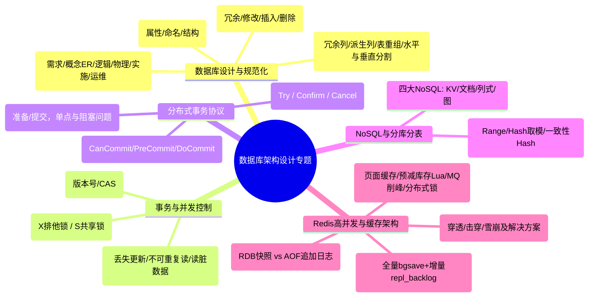

# 直播第4次：数据库案例分析与高并发架构专题

- **源课件**：`202611架构师直播第4次-数据库案例.pdf`
- **页数**：70 页
- **主讲**：姜美荣

---

## 一、本课概要

数据库是软考系统架构设计师案例分析中**分值最重（历年稳定 25 分大题）**的核心模块。本课深入解析数据库设计六大阶段、规范化与反规范化权衡、分布式事务一致性（2PC / 3PC / TCC）、NoSQL 数据库选型、分库分表策略，以及 **Redis 缓存高并发场景（秒杀、互斥锁、逻辑过期、持久化 RDB/AOF、主从全量/增量同步）**的经典真题与答题策略。

---

## 二、知识结构 / 知识图谱

---

## 三、核心考点与原理详解

### 1. 数据库设计阶段与分 E-R 图合并冲突

- **设计六阶段**：
  1. **需求分析**：产出 DFD、数据字典、需求说明书。
  2. **概念结构设计**：绘制局部 E-R 图并合并为全局 E-R 图。
  3. **逻辑结构设计**：E-R 模型转换为关系模式、确定完整性约束、规范化设计（转为 3NF/BCNF）。
  4. **物理结构设计**：确定数据分布、存储结构、索引策略及存取路径。
  5. **数据库实施**：建立库表、加载数据、编写调试存储过程/触发器、试运行。
  6. **运行与维护**：性能监控调优、备份恢复、库表重构（DBA 负责）。
- **分 E-R 图合并的三大冲突**：
  - **属性冲突**：同一属性在不同图中的类型、取值范围或单位不同。
  - **命名冲突**：同名异义（同一名称代表不同实体）或异名同义（不同名称代表同一实体）。
  - **结构冲突**：同一对象在某一图中被抽象为实体，而在另一图中被抽象为属性。

---

### 2. 规范化 vs 反规范化（架构权衡必考）

- **不规范化带来的四大问题**：
  - **数据冗余**：信息重复存储，浪费空间。
  - **修改异常**：修改一处需同步修改多处，极易导致数据不一致。
  - **插入异常**：关键实体尚未关联时，无法单独录入数据。
  - **删除异常**：删除某项记录时意外删除了其它重要实体的关联信息。
- **反规范化技术（以空间和一致性换取查询性能）**：
  - **常见手段**：增加冗余列、增加派生列、重新组表、水平分割表、垂直分割表。
  - **反规范化带来的挑战与数据一致性维护手段**：
    1. **触发器（Trigger）**：底层自动同步冗余字段。
    2. **应用程序逻辑同步**：业务代码双写或异步更新。
    3. **批处理定时任务**：定时重算与校验。
    4. **事务机制**：保证关联表写入的原子性。

---

### 3. 并发事务问题与封锁协议

- **并发控制三大典型问题**：
  - **丢失更新**：事务 A 和事务 B 同时修改数据 $X$，事务 B 的提交覆盖了事务 A 的提交。
  - **不可重复读**：事务 A 两次读取数据 $X$，期间事务 B 修改了 $X$ 并提交，导致事务 A 两次读取结果不一致。
  - **读脏数据**：事务 A 修改了 $X$，事务 B 读取了 $X$，随后事务 A 回滚，事务 B 读到的是无效数据。
- **封锁类型**：
  - **排他锁（X 锁 / 写锁）**：独占资源，加锁后仅允许当前事务读写，其他事务不能加任何锁。
  - **共享锁（S 锁 / 读锁）**：共享资源，允许多个事务同时加 S 锁并发读取，但阻止任何事务加 X 锁修改。

---

### 4. 悲观锁 vs 乐观锁深度对比

| 对比维度 | 悲观锁（Pessimistic Lock） | 乐观锁（Optimistic Lock） |
| :--- | :--- | :--- |
| **核心假设** | 认为并发冲突概率高，操作前先上锁 | 认为并发冲突概率低，提交更新时才校验 |
| **实现机制** | 数据库显式锁（`SELECT ... FOR UPDATE`） | **版本号机制（`version`）**、时间戳、CAS 算法 |
| **并发性能** | 锁竞争激烈，阻塞等待，吞吐量较低 | **无锁非阻塞，高并发性能极佳** |
| **死锁风险** | 存在死锁可能，需严格定义加锁顺序 | **完全无死锁风险** |
| **适用场景** | **写多读少**、冲突激烈、一致性要求极其严格的场景 | **读多写少**、冲突较少的互联网高并发场景 |

---

### 5. 分布式事务协议：2PC、3PC 与 TCC

- **两阶段提交（2PC）**：
  - **表决阶段（Prepare）**：协调者询问各参与者是否可以提交，参与者执行本地事务但不提交，返回 Yes/No（一票否决）。
  - **执行阶段（Commit）**：全员 Yes 则协调者发 Commit，否则发 Rollback。
  - **缺点**：**同步阻塞**、单点故障（协调者挂掉导致参与者资源锁定）、数据不一致（网络分区导致部分提交）。
- **三阶段提交（3PC）**：
  - 划分为 **CanCommit $\to$ PreCommit $\to$ DoCommit**。
  - 引入**参与者超时机制**与预提交缓冲，有效缓解长时间阻塞问题。
- **TCC 模式（业务层补偿型）**：
  - **Try 阶段**：尝试执行，完成业务检查，**预留所有必需业务资源**。
  - **Confirm 阶段**：确认执行，真正使用预留资源，要求操作具备**幂等性**。
  - **Cancel 阶段**：取消执行，释放 Try 阶段预留的资源，要求具备幂等性。
  - **优势**：无底层长事务锁，并发度极高，适合跨微服务强一致性业务。

---

### 6. Redis 持久化与主从同步机制

- **RDB（快照持久化）vs AOF（追加日志）**：
  - **RDB**：定时将内存全量数据生成二进制快照保存（`bgsave` fork 子进程）。
    - *优点*：文件紧凑、恢复速度极快；*缺点*：两次快照间宕机会丢失数据。
  - **AOF**：将每个写命令记录到日志文件（`appendfsync: everysec / always`）。
    - *优点*：数据安全性高（最多丢失 1 秒数据）；*缺点*：文件体积大、恢复慢、需定期 rewrite。
  - *生产推荐*：**混合持久化（RDB + AOF）**。
- **Redis 主从复制全流程**：
  1. **首次全量同步**：从库发 `psync ? -1` $\to$ 主库执行 `bgsave` 生成 RDB 发送给从库 $\to$ 从库清空本地并加载 RDB $\to$ 主库将期间缓冲区的写命令发给从库回放。
  2. **网络断开增量同步**：从库发 `psync <runid> <offset>` $\to$ 主库检查复制积压缓冲区（`repl_backlog_buffer`），若偏移量在范围内则增量补发命令。

---

### 7. 缓存三难与高并发秒杀优化策略

#### 缓存经典三大问题与解法
1. **缓存穿透**（查询不存在的数据，直接穿透到 DB）：
   - **解法**：**布隆过滤器（Bloom Filter）**拦截、缓存空对象（设置短过期时间）。
2. **缓存击穿**（热点 Key 瞬间过期，海量请求涌向 DB）：
   - **解法**：**互斥锁（Mutex Lock / SETNX）**只允许一个线程查库回填、**逻辑过期（Logical Expiration）**异步刷新。
3. **缓存雪崩**（大量 Key 在同一时间集中过期，或 Redis 宕机）：
   - **解法**：**过期时间加随机扰动值（Jitter）**、Redis 集群高可用部署、服务熔断与限流降级。

#### 高并发秒杀场景四大优化策略（2026 真题标准答案）
1. **页面静态化与客户端/CDN 缓存**：提前将秒杀页面静态资源推送到 CDN 与浏览器本地缓存。
2. **Redis 内存预扣减库存**：通过 Lua 脚本执行原子扣减（`DECR`），杜绝超卖，所有读写都在内存完成。
3. **消息队列异步削峰**：秒杀成功请求写入 MQ（如 Kafka/RocketMQ），后端异步消费逐步扣减 MySQL 真实库存并生成订单。
4. **分布式锁与多级限流**：使用 Redis 分布式锁控制用户重复下单，在网关层采用令牌桶/漏桶算法限流。

---

## 四、精选真题与案例演练

### 【真题】容灾建设指标与数据库同步复制（2026.05 系分/架构）

- **两大核心灾备指标**：
  - **RPO（Recovery Point Objective，恢复点目标）**：系统能容忍的**最大数据丢失量（时间维度）**。$\text{RPO} = 0$ 表示零数据丢失。
  - **RTO（Recovery Time Objective，恢复时间目标）**：系统从灾难发生到**恢复正常服务所需的最大时间**。
- **数据库同步复制 vs 异步复制对比**：
  - **同步复制**：主库写成功且从库写成功才返回客户端。**优点**：$\text{RPO} = 0$，数据绝对一致；**缺点**：网络延迟增大响应时间，吞吐量下降。
  - **异步复制**：主库写成功立即返回，后台异步复制到从库。**优点**：主库性能高、低延迟；**缺点**：主库故障时存在数据丢失风险（$\text{RPO} > 0$）。

---

## 五、备考与冲刺提示

1. **25 分大题答题规律**：
   - 第一问通常考：关系模式范式判定、E-R 图实体联系、或悲观锁/乐观锁对比。
   - 第二问通常考：反规范化技术手段、分布式事务协议（2PC/3PC/TCC 阶段划分）。
   - 第三问通常考：Redis 缓存架构、缓存穿透/击穿/雪崩解决方案、秒杀系统设计。
2. **规范术语背诵**：
   - 谈到 Redis 分布式锁：必写 `SET key value NX PX`、`Lua脚本保证原子性`。
   - 谈到高并发优化：必写 `动静分离`、`缓存预热`、`消息队列异步削峰`、`读写分离与分库分表`。
