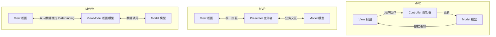

# 直播第6次：层次式架构、物联网架构与 SOA / 微服务设计专题

- **源课件**：`202611架构师直播第6次-架构设计2.pdf`
- **页数**：58 页
- **主讲**：姜美荣

---

## 一、本课概要

本课深入讲解现代软件系统中应用最为广泛的**层次式架构（N 层架构、MVC/MVP/MVVM 演进、业务逻辑容器与 ORM）**、**物联网四层体系与 MQTT 协议机制**，以及**面向服务的体系结构（SOA、ESB、REST、Web Service）与微服务架构设计**。重点剖析架构演进动机、设计模式对比与软考案例高频题型。

---

## 二、知识结构 / 知识图谱

```mermaid
mindmap
  root((现代架构与SOA专题))
    层次式架构演化
      C/S与B/S架构
        两层C/S(胖客户端)
        三层C/S(瘦客户端+应用层+DB)
        B/S(零客户端/易维护)
        RIA富互联网应用
      分层表现层模式
        MVC(Controller中转)
        MVP(Presenter完全解耦Model与View)
        MVVM(ViewModel + DataBinding双向绑定)
      中间层与数据访问层
        业务容器(Domain Model - Service - Control)
        ORM对象关系映射(Hibernate vs MyBatis)
        分层陷阱: 污水池反模式(Sinkhole)
    物联网(IoT)架构
      四层体系结构: 感知层 / 网络层 / 平台层 / 应用层
      MQTT协议机制
        轻量发布/订阅模式
        3级QoS(0最多一次/1至少一次/2恰好一次)
        3类消息持久性(非持久/队列型/确认型)
        MQTT vs HTTP 核心指标深度对比
    面向服务架构(SOA)与微服务
      SOA核心原则: 粗粒度 / 松耦合 / 契约中立
      SOA关键实现技术
        Web Service(SOAP/WSDL/UDDI)
        RESTful API(无状态/统一接口/资源定位)
        ESB企业服务总线(协议转换/消息路由/服务编排)
      SOA vs 微服务模式对比
```

---

## 三、核心考点与原理详解

### 1. 表现层设计模式演化（MVC $\to$ MVP $\to$ MVVM）



| 模式 | 核心结构 | 视图与模型交互 | 优点 | 缺点 / 适用场景 |
| :--- | :--- | :--- | :--- | :--- |
| **MVC** | Model - View - Controller | 允许 View 监听并直接读取 Model | 职责清晰，支持多视图复用同一模型 | View 与 Model 依然存在耦合，单元测试困难 |
| **MVP** | Model - View - Presenter | **完全隔离**，所有通信必须经由 Presenter | 模型与视图彻底解耦，**Presenter 可脱离 UI 单测** | UI 复杂度增加时，Presenter 接口极其臃肿（Android 常用） |
| **MVVM** | Model - View - ViewModel | 通过 **ViewModel 实现双向数据绑定** | **数据驱动 UI**，减少大量胶水代码，开发效率高 | 数据绑定调试排错较困难（前端 Vue/React/WPF 首选） |

---

### 2. 层次式架构关键设计陷阱

- **污水池反模式（Sinkhole Anti-pattern）**：
  - **定义**：请求流从表现层穿过中间层直达数据层，中间层基本没有做任何业务处理（仅做透传）。
  - **应对策略**：当透传请求超过 **20%** 时，应当考虑引入**开放层（Open Layer）**，允许表现层绕过某些中间层直接调用数据访问层。
- **业务逻辑层容器化（Domain Model - Service - Control）**：
  - `Domain Model`（领域模型）：仅包含领域业务属性。
  - `Service`（业务服务）：实现具体的业务操作与契约接口。
  - `Control`（服务控制器）：负责服务间的路由、编排与流程切换。

---

### 3. 物联网体系结构与 MQTT 协议

- **物联网四层架构**：
  1. **感知层**：传感器、RFID、摄像头、执行器、通信模组（负责数据采集）。
  2. **网络层**：5G/4G、NB-IoT、LoRa、Wi-Fi、ZigBee（负责信息传输）。
  3. **平台层**：设备管理平台（DMP）、连接管理平台（CMP）、数据分析平台。
  4. **应用层**：智能家居、智慧城市、工业物联网、车联网。
- **MQTT 协议核心机制**：
  - **基于发布/订阅（Pub/Sub）模式**：消息发布者与订阅者完全解耦。
  - **长连接与极低开销**：基于 TCP，报文头部最小仅 2 字节，专为弱网与低功耗设备设计。
  - **3 级服务质量（QoS）**：
    - `QoS 0`（最多一次，At most once）：消息可能丢失，无确认机制。
    - `QoS 1`（至少一次，At least once）：保证到达，但可能产生重复消息（需消费端幂等）。
    - `QoS 2`（恰好一次，Exactly once）：通过四次握手确保消息不漏不重，网络开销最大。

---

### 4. MQTT vs HTTP 协议全方位对比

| 对比维度 | HTTP 协议 | MQTT 协议 |
| :--- | :--- | :--- |
| **通信模式** | 客户端-服务器 **请求-响应（一对一）** | **发布-订阅（一对多，生产者消费者解耦）** |
| **连接机制** | 短连接为主（HTTP/1.1 支持 keep-alive） | **基于 TCP 的持久长连接（心跳保活）** |
| **消息模型** | 同步阻塞，客户端拉取（Pull） | **异步非阻塞，服务端实时推送（Push）** |
| **协议开销** | 头部几百字节至数 KB（文本冗余） | **头部最小 2 字节（精简二进制）** |
| **服务质量** | 无内置 QoS 机制 | **内置 3 级 QoS 保证（QoS 0 / 1 / 2）** |
| **设备与网络** | 适合高带宽、网络稳定、算力充足设备 | **适合弱网、低带宽、资源受限传感器与嵌入式设备** |

---

### 5. 面向服务的体系结构（SOA）与微服务

- **SOA 核心理念**：
  - 将企业业务应用划分为**粗粒度、松耦合、平台中立**的“服务”，通过标准化接口契约连接。
- **SOA 实现模式**：
  1. **Web Services**：基于 XML、SOAP（通信协议）、WSDL（服务描述语言）、UDDI（服务注册发现）。
  2. **RESTful Services**：基于 HTTP 动词（GET/POST/PUT/DELETE）、轻量级 JSON 传输。
  3. **企业服务总线（ESB）**：核心功能包括**服务寻址与路由、协议转换、数据格式转换（XML/JSON）、服务组合与消息编排**。
- **SOA vs 微服务模式对比**：
  - **架构形态**：SOA 倾向于通过 ESB 集中式总线集成异构老系统；微服务倾向于**去中心化（智能端点 + 哑管道，Smart Endpoints and Dumb Pipes）**。
  - **服务粒度**：SOA 属于粗粒度服务（企业级复用）；微服务属于细粒度单一职责（围绕业务领域边界上下文拆分）。
  - **数据存储**：SOA 往往共享大型中心数据库；微服务倡导**Database per Service（每个微服务拥有独立数据库）**。

---

## 四、经典案例分析与答题实战

### 【案例 1】电商移动端表现层架构选型（2025.11 真题）

#### 场景与问题
某电商平台开发移动端 App，界面元素复杂、高频动态更新（秒杀倒计时、库存变化）、团队希望减少胶水代码并提高迭代效率。架构师应推荐 MVC、MVP 还是 MVVM？说明理由。

#### 答题标准答案
1. **推荐选型**：推荐采用 **MVVM（Model-View-ViewModel）** 架构模式。
2. **决策理由**：
   - **双向数据绑定**：MVVM 通过 DataBinding 实现 View 与 ViewModel 的自动同步，商品数据或倒计时更新时自动驱动界面刷新，无需手动编写大量更新 UI 的冗余代码。
   - **解耦与易维护**：ViewModel 不持有 View 的直接引用，隔离了 UI 展示与业务数据转换，便于团队并行开发。
   - **适应复杂高频交互**：相比 MVP 中 Presenter 接口容易急剧膨胀，MVVM 很好地解决了 UI 种类多、事件繁杂的问题。

---

### 【案例 2】企业集成中 ESB 的核心功能（经典真题）

- **问题**：在 SOA 架构演进中，企业引入 ESB（企业服务总线）的主要作用是什么？
- **标准答案**：
  1. **协议转换**：支持 HTTP、JMS、FTP、SOAP 等不同通信协议之间的透明转换。
  2. **消息路由**：根据消息内容或请求头部动态路由到目标服务。
  3. **数据格式转换与映射**：实现 XML、JSON、自定义二进制格式之间的映射与清洗。
  4. **服务编排与组合**：将多个细粒度基础服务组合编排为高层业务流程。
  5. **服务安全与监控**：提供集中的身份认证、访问控制、服务限流与调用链日志审计。

---

## 五、备考与冲刺提示

1. **表现层选型口诀**：
   - 传统 Web 单体 $\to$ MVC；
   - 移动端/桌面端强调单元测试 $\to$ MVP；
   - 现代化动态数据驱动 UI（Vue/React/复杂App） $\to$ MVVM。
2. **物联网案例答题规范**：
   - 遇到传感器、弱网、低功耗、消息推送 $\to$ 必答 **MQTT 协议**，并分析其 3 级 QoS 和长连接推送优势。
