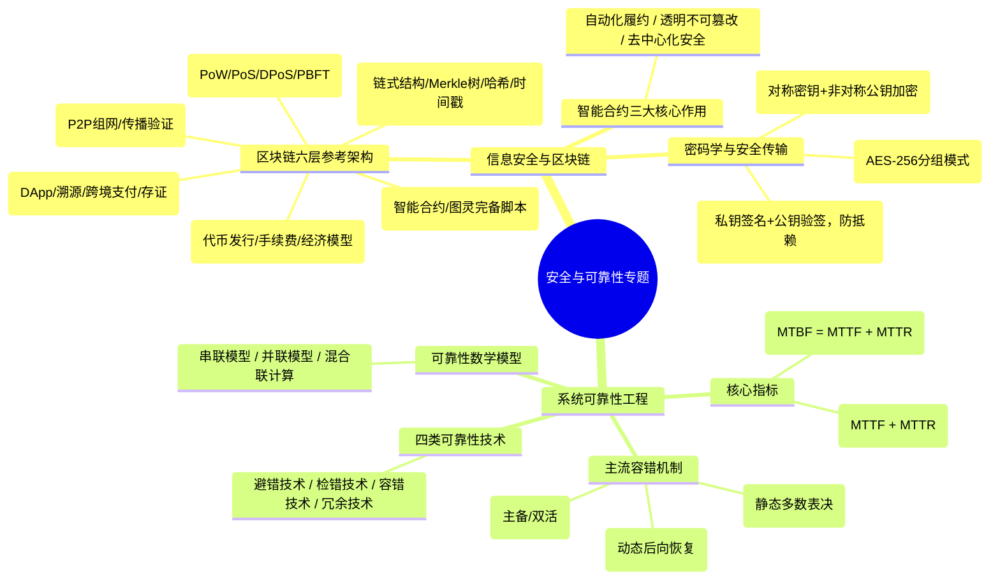
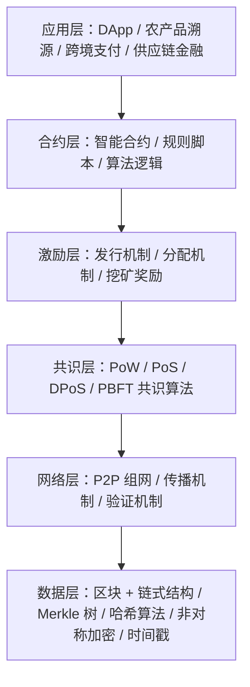

# 直播第7次：安全架构、区块链技术与可靠性设计案例专题

- **源课件**：`202611架构师直播第7次-安全和可靠性案例.pdf`
- **页数**：36 页
- **主讲**：姜美荣

---

## 一、本课概要

本课重点围绕系统架构中的两大关键非功能特性——**信息安全（区块链技术架构、数字信封、非对称加密与数字签名）** 与 **系统可靠性（容错技术、冗余模型、可靠性指标与故障树 FTA）** 进行案例剖析。涵盖 AIoT 云边端智能安防、农产品区块链溯源存证、文件安全传输体系等高频真题。

---

## 二、知识结构 / 知识图谱

---

## 三、核心考点与原理详解

### 1. 区块链体系结构（六层模型必考）

| 层次 | 核心技术与组成 | 核心功能与作用 |
| :--- | :--- | :--- |
| **数据层** | 链式区块、Merkle 树、SHA-256 哈希、非对称加密、时间戳 | 封装底层数据结构，保证**数据不可篡改、可溯源与完整性** |
| **网络层** | P2P 对等网络、传播机制、验证机制 | 实现节点间的自治互联与新区块/交易的广播同步 |
| **共识层** | PoW（工作量证明）、PoS（权益证明）、DPoS、PBFT | **解决分布式记账权分配与双花问题**，确保全网账本一致性 |
| **激励层** | 经济模型、代币发行与分配规则、交易手续费 | 激励矿工/验证节点积极参与记账，维护生态可持续性（私有链/联盟链可弱化） |
| **合约层** | 智能合约（Smart Contract）、执行代码 | 将业务逻辑固化为链上可执行代码，**条件满足时自动触发执行** |
| **应用层** | DApp、客户端界面、API 网关 | 直接面向业务场景（溯源、存证、审计、DeFi）提供服务交互 |

---

### 2. 智能合约的三大核心作用

1. **自动化履约**：当预设业务条件满足时，由链上节点自动执行资产交割或状态更新，**大幅降低信任成本与人工干预**。
2. **透明性与不可篡改性**：合约代码公开可验证，一旦部署上链即通过共识机制永久锁定，任何人无法单方面篡改执行逻辑。
3. **去中心化与安全性**：运行于去中心化虚拟环境中，依托密码学和多数节点共识，消除单点故障与中心机构违约风险。

---

### 3. 数字信封与安全传输机制（密码学综合）

在大文件安全传输与防篡改、防抵赖场景中，经典数字信封架构流程：
1. **发送方处理**：
   - 生成随机对称会话密钥 $K$；
   - 用 $K$ 对大文件进行**对称加密**（如 AES-256），生成**文件密文**；
   - 用**接收方公钥 $P_b$** 对会话密钥 $K$ 进行加密，生成**数字信封（密钥密文）**；
   - 对原始文件进行 Hash 计算得到**摘要**，并用**发送方私钥 $S_a$** 对摘要进行加密，生成**数字签名**。
2. **接收方处理**：
   - 用**接收方私钥 $S_b$** 解密数字信封，恢复对称密钥 $K$；
   - 用对称密钥 $K$ 解密文件密文，得到原始文件；
   - 用**发送方公钥 $P_a$** 解密数字签名，恢复原摘要；
   - 对解密出的文件重新计算 Hash 摘要并与原摘要比对（**一致则说明未被篡改且发送方不可抵赖**）。

---

### 4. 软件可靠性工程与容错技术

- **可靠性核心指标与关系**：
  - **MTTF（平均无故障时间）**：系统正常运行到发生故障的平均时长。
  - **MTTR（平均修复时间）**：从故障发生到修复完成的平均时长。
  - **MTBF（平均故障间隔时间）**：相邻两次故障之间的平均间隔时间。
  - **数学关系**：
    $$\text{MTBF} = \text{MTTF} + \text{MTTR}$$
    $$\text{系统可用度 } A = \frac{\text{MTTF}}{\text{MTTF} + \text{MTTR}} = \frac{\text{MTTF}}{\text{MTBF}}$$
- **四大可靠性技术范畴**：
  1. **避错（Fault Avoidance）**：通过形式化设计、代码评审、严格测试杜绝缺陷引入。
  2. **检错（Fault Detection）**：通过状态监控、心跳探测、超时机制及时发现故障。
  3. **容错（Fault Tolerance）**：故障发生后系统**仍能自动维持正常功能或降级运行**。
  4. **冗余（Redundancy）**：结构冗余（硬件/软件备份）、信息冗余（校验码）、时间冗余（重复执行）、附加冗余。
- **主流软件容错方案对比**：
  - **恢复块方法（Recovery Block）**：
    - **机制**：采用**主块 + 多个后备块**，前向执行并经“验收测试”；若未通过则回滚（动态后向恢复）并切换到后备块重新计算。
  - **$N$ 版本程序设计（$N$-Version Programming）**：
    - **机制**：由多组独立团队开发 $N$ 个功能相同的版本并行运行，通过**多数表决器（Voter）**输出结果（静态前向恢复）。
  - **防卫式程序设计（Defensive Programming）**：
    - 在关键逻辑入口/出口加入异常捕获、参数合法性断言与错误恢复分支。

---

### 5. 可靠性模型数学计算

- **串联系统（全部正常才正常）**：
  $$R_{\text{sys}} = \prod_{i=1}^n R_i = R_1 \times R_2 \times \cdots \times R_n$$
  $$\lambda_{\text{sys}} = \sum_{i=1}^n \lambda_i$$
- **并联系统（一个正常即正常）**：
  $$R_{\text{sys}} = 1 - \prod_{i=1}^n (1 - R_i) = 1 - (1 - R_1)(1 - R_2)\cdots(1 - R_n)$$
- **混合联系统**：先计算局部并联等效可靠度，再代入全局串联公式。

---

## 四、经典案例分析与答题实战

### 【案例 1】AIoT 云边端协同智能安防架构（2026.05 真题）

#### 四层架构职责划分
1. **感知层**：周界保护传感器、人脸识别摄像头、门禁读卡器（负责物理信号采集与数字化）。
2. **边缘层**：智能门禁控制器、边缘网关（负责**本地就近快速决策与联动响应，断网自治**）。
3. **AI 决策层**：融合认知引擎、视觉深度分析引擎、模型训练 OTA（负责多源大数据深度分析与模型迭代）。
4. **应用层**：移动 App 操作入口、安防监控大屏、第三方系统开放集成。

#### 云边端四层架构的潜在缺陷与挑战（答题标准点）
1. **边缘算力与资源受限**：复杂的超大 AI 模型无法直接下沉边缘。
2. **模型版本与数据同步困难**：网络波动导致云端与边缘端模型状态存在不一致风险。
3. **安全攻击面扩大**：边缘节点物理分布广且缺乏防护，易遭受物理接入破解与网络渗透。
4. **运维成本高昂**：边缘异构设备众多，固件升级与故障排查难度显著上升。

---

### 【案例 2】农产品区块链溯源全流程（2025.05 真题）

#### 角色与全流程协同
1. **信息录入人员**：录入批次、产地等基础数据，将检测原件凭证上传至 **IPFS 分布式存储**，调用智能合约生成哈希上链，生成带时间戳存证。
2. **核对人员**：比对原始凭证与链上哈希，执行二级加密签名，触发智能合约进入审核队列。
3. **审核人员**：调取全流程链上不可篡改日志，复核数据修改记录（超 2/3 节点共识），确认后**激活时间锁使数据进入只读状态**，下发可验证数字凭证。

---

## 五、备考与冲刺提示

1. **区块链分层答题诀窍**：按“数据、网络、共识、激励、合约、应用”自底向上梳理，每层写出 2 个代表技术。
2. **数字信封作图与连线题**：牢记“**公钥加密、私钥解密**用于保密；**私钥签名、公钥验签**用于身份认证与防抵赖”。
3. **可靠性容错方案选择**：
   - 要求“多版本并行执行+表决” $\to$ **$N$ 版本程序设计**；
   - 要求“主备执行+验收测试不通过回退重做” $\to$ **恢复块方法**。
